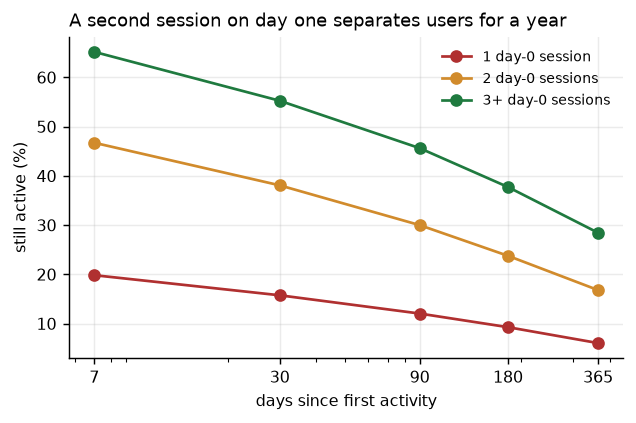
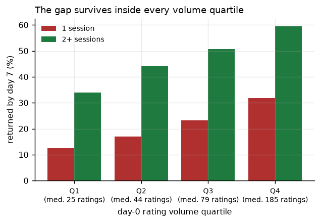

# Does a second session on day one predict retention?

A product-analytics study on **MovieLens 10M** — 10,000,054 ratings from 69,878 users
between 1995 and 2009 — asking whether anything a user does on their first day predicts
whether they are still around a week later, and whether that prediction is worth acting
on.

It is worth acting on. It is not worth A/B testing, and the second half of this repo is
about why.

```bash
make setup && make data   # venv + the 63MB download, converted to parquet (~2 min)
make all                  # lint, tests, and the full study
```

---

## What the data says

**Retention collapses in the first week and then flattens.** 32.6% of users are still
active on day 1, 26.8% on day 7, 21.7% on day 30, 9.1% at a year. Whatever decides a
user's fate has mostly decided it before the first week is out.

**One day-0 behaviour separates users sharply: whether they came back for a second
session that same day.**

| Day-0 behaviour | Users | Returned by day 7 |
|---|---:|---:|
| 1 session | 51,761 (78.5%) | **19.8%** |
| 2+ sessions | 14,186 (21.5%) | **52.4%** |

A 32.6 percentage-point gap, and it is *durable* — at day 365 the split is 6.0% against
20.4%, still 3.4× apart, so this is not one burst of activity being counted twice.



**The obvious objection is that this is just volume.** Users with two sessions also rate
more, and rating more is its own signal. So the comparison is redone inside each quartile
of day-0 rating volume, comparing users who rated roughly the same amount and differ only
in whether they spread it across one sitting or two:

| Day-0 volume | Median ratings | 1 session | 2+ sessions | Lift |
|---|---:|---:|---:|---:|
| Q1 | 25 | 12.4% | 33.9% | 2.73× |
| Q2 | 44 | 17.1% | 44.0% | 2.58× |
| Q3 | 79 | 23.1% | 50.8% | 2.19× |
| Q4 | 185 | 31.9% | 59.5% | 1.87× |

The gap survives in every quartile, so session count carries information volume does not.
It also **attenuates as volume rises**, from 2.73× to 1.87× — part of the raw gap really
was volume wearing a disguise, and the honest read says both things.



A logistic model with volume, catalogue popularity and rating variance all competing
leaves the session effect at an **odds ratio of 3.26** (95% CI 3.13–3.40; the p-value
underflows to zero).
The same model's **pseudo-R² is 0.099** — day-0 behaviour shifts the odds a lot and still
leaves most of the outcome unexplained. Both numbers are the finding.

**Two robustness checks, because a result that exists only under one arbitrary choice is
a result about the choice.** The effect holds in every signup cohort from 1996 to 2008
(lift 1.84×–3.16×, through fourteen years of the product and the internet changing), and
it survives redefining "a session" at 10, 30, 60 and 120-minute gaps (lift 2.46×–2.73×).

---

## What it does *not* say

This is observational. Users who return within a day do so **because they were more
interested**, and no amount of re-engagement manufactures interest. So the 32.6pp gap is
a ceiling on the opportunity, not a forecast of it:

| If we convert… | and the induced session carries… | absolute lift |
|---|---|---:|
| 5% of single-session users | 10% of the effect | +0.16pp |
| 10% | 25% | +0.81pp |
| 20% | 50% | +3.26pp |

The number a portfolio project prints in bold is +32.6pp. The number worth planning
against is under 1pp, and it is the whole reason the next section exists.

---

## Then test it? No — the test is infeasible, and that is the finding

The intervention that follows ("nudge users who finish a first session and don't return")
only fires for the 78.5% who are single-session, so enrolment is all new users and only
the triggered share is analysable. At this product's actual traffic — **10.5 new users
per day**, measured over 2007–2008 rather than flattered by fourteen years of history:

| To detect | Users per arm | Time at current traffic |
|---|---:|---:|
| +1pp | 25,420 | 16.8 years |
| +2pp | 6,468 | **4.3 years** |
| +3pp | 2,923 | 1.9 years |
| +5pp | 1,086 | 0.7 years |

Inverted, which is the question that actually matters: **one quarter of traffic buys a
minimum detectable effect of 8.2pp** — a 41% relative improvement in return rate. Nothing
plausible about a re-engagement email is that large, and the scenario table above says the
realistic effect is under 1pp. A quarter-long test would not detect the effect if it were
real; it would return "no significant difference" and be read as "the idea doesn't work."

Nor can you look early and stop when it goes green: peeking daily for 14 days turns a 5%
false-positive rate into **21.4%**.

**So the recommendation is not "run an A/B test."** It is: ship the nudge to everyone,
instrument it, and judge it on the intermediate metric the mechanism actually moves —
second-session rate — where the effect is large enough to see. Then keep the 8.2pp MDE
in hand as the answer to "why didn't you test it."

`src/activation/experiment.py` carries the sizing, an **SRM check** (the first thing to
run on any readout and the most commonly skipped), a two-proportion readout that leads
with the confidence interval rather than the p-value, and the peeking inflation table.

---

## How it is built

```
src/activation/ingest.py      253MB of `::`-delimited text -> typed parquet
src/activation/features.py    day-0 predictors, day-7 outcome, and the eligibility rule
src/activation/analysis.py    retention, confounding checks, the logistic model
src/activation/experiment.py  sample size, SRM, readout, peeking
analysis/run_study.py         runs all of it -> results/findings.json + figures/
```

**Two design rules do most of the work.** Predictors come only from day 0 and the outcome
only from day 7 onward, with a six-day gap between them — a feature computed over a window
that overlaps the outcome predicts it trivially and means nothing.

And **users whose retention is forced by the dataset's construction are excluded.**
MovieLens only publishes users with 20+ ratings *in total*, so a user who rated 12 movies
on day 0 is guaranteed to return; their retention is an artifact of the filter. Requiring
20 ratings *within day 0* keeps 65,947 of 69,878 users. Left in, they invert the headline:
the raw data appears to show that rating *less* on day one predicts coming back.

The dataset itself is not committed — it is 89MB derived deterministically from a public
download, and `make data` rebuilds it. `results/findings.json` **is** committed: every
number above is read from it, and `tests/test_findings.py` asserts the claims this README
makes, so an analysis change that moves a headline fails CI instead of quietly ageing the
prose.

One caveat that travels with all of it: MovieLens has no account-creation event, so
"signup" is the first rating observed. Every user here is already activated to the extent
of one action, which biases every retention number upward relative to a real product where
a large share of signups never act at all.

## Data

MovieLens 10M, [GroupLens Research](https://grouplens.org/datasets/movielens/10m/),
used under the terms of its
[README](https://files.grouplens.org/datasets/movielens/ml-10m-README.html).
